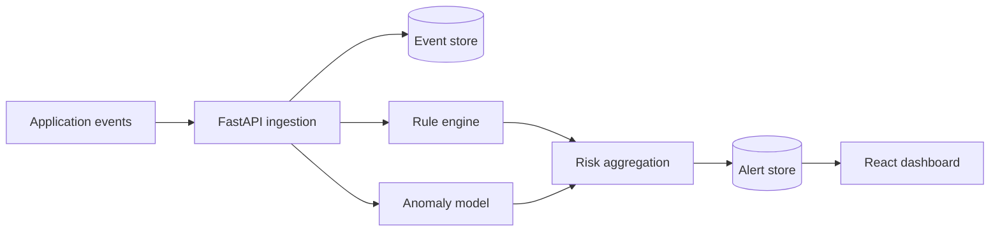

# SentinelScope — Intelligent Security Monitoring

SentinelScope is a full-stack security monitoring MVP that ingests authentication and API activity, combines transparent detection rules with behavioral anomaly scoring, and presents explainable alerts to an analyst.

> This is an educational defensive-security project. The attack simulator generates events only inside the application; it does not scan or attack external systems.

## What it demonstrates

- FastAPI REST API with JWT authentication and role checks
- Rule-based detection for brute force, unusual login time, repeated authorization failures and privilege escalation
- Isolation Forest behavioral anomaly score
- Human-readable alert explanations and MITRE ATT&CK mappings
- React analyst dashboard with live summaries and simulation controls
- SQLAlchemy persistence (SQLite locally, PostgreSQL-ready through `DATABASE_URL`)
- Docker Compose, unit tests and GitHub Actions CI

## Architecture



## Quick start with Docker

```bash
cp .env.example .env
docker compose up --build
```

Open `http://localhost:5173`. The local demo account is `admin` / `change-me-before-production`. Change it in `.env` before any non-local deployment.

## Run locally

Backend:

```bash
cd backend
python -m venv .venv
source .venv/bin/activate  # Windows: .venv\Scripts\activate
pip install -r requirements.txt
uvicorn app.main:app --reload
```

Frontend:

```bash
cd frontend
npm install
npm run dev
```

## Demo scenarios

- `brute_force`: repeated failed logins from one IP
- `privilege_escalation`: unauthorized role change attempt
- `unusual_login`: successful login at an unusual hour
- `normal`: benign API activity

Use the dashboard buttons or call `POST /api/v1/simulations/{scenario}` after login. API documentation is available at `http://localhost:8000/docs`.

## Detection design

Each event receives:

1. Deterministic rule findings with evidence.
2. An Isolation Forest anomaly score based on hour, outcome, event type, role and recent activity.
3. A combined 0–100 risk score.

An alert is created at a risk score of 50 or above. The dashboard shows the exact signals that contributed to the decision; anomaly output is never presented as proof of an attack.

## Tests

```bash
cd backend
python -m unittest discover -s tests -v
```

## Roadmap

- PostgreSQL migrations with Alembic
- GeoIP-based impossible-travel detection
- Sigma rule import and event correlation
- WebSocket live updates and notification channels
- Analyst feedback loop and model monitoring
- OpenTelemetry metrics and structured audit logs

## License

MIT
