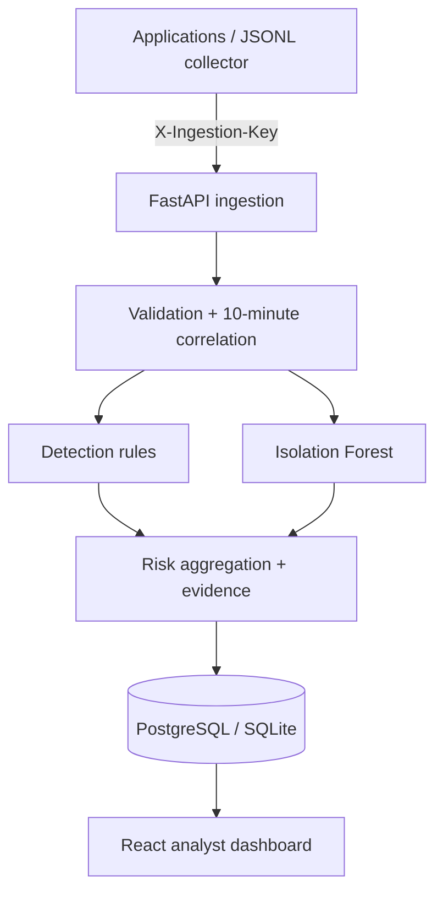

# SentinelScope — Intelligent Security Monitoring

[](https://github.com/bbmuti/-intelligent-security-monitoring/actions/workflows/ci.yml)
[](https://www.python.org/)
[](https://react.dev/)
[](LICENSE)

SentinelScope is a full-stack defensive-security platform that ingests authentication and API activity, correlates deterministic detection rules with behavioral anomaly scoring, and turns the result into explainable alerts for an analyst.

It is designed as a portfolio-grade security engineering MVP: the project demonstrates backend development, data modeling, applied machine learning, security controls, a usable analyst workflow, automated tests, database migrations, containers, and CI security scanning in one coherent system.

> [!IMPORTANT]
> SentinelScope is an educational defensive-security project, not a production SIEM. Its simulator creates synthetic events only inside the application and never scans or attacks external systems.

## Why this project exists

Security teams need more than a binary “malicious” label. They need to know what happened, why it was considered risky, which evidence contributed to the decision, and what to do with the finding. SentinelScope keeps that reasoning visible while combining two complementary approaches:

- deterministic rules for recognizable attack patterns;
- Isolation Forest scoring for unusual behavior that a static rule may miss.

Every stored event receives an anomaly score and combined risk score. Findings above the alert threshold include human-readable evidence and a relevant MITRE ATT&CK technique.

## Current capabilities

- Service-authenticated batch ingestion for real JSON/JSONL event sources
- Analyst authentication with short-lived access tokens and rotating, revocable refresh sessions
- Brute-force, unusual-hour login, repeated authorization failure, privilege-escalation, rapid-country-change, and behavioral-anomaly detection
- A personal behavioral baseline after 30 successful events, with a deterministic global fallback before enough history exists
- Explainable 0–100 risk scoring and MITRE ATT&CK context
- Alert triage states: `open`, `investigating`, `resolved`, and `false_positive`
- Searchable event stream, filtered alert queue, evidence drawer, detection lab, and audit trail
- Automatic dashboard refresh every 10 seconds
- PostgreSQL deployment with Alembic migrations; SQLite for lightweight local development and tests
- Docker Compose, health/readiness probes, CI, Bandit, Ruff, Dependabot, and coverage enforcement

## Architecture



| Layer | Technology | Responsibility |
|---|---|---|
| Web | React 19, Vite, Lucide | Analyst login, overview, triage, event search, simulations, audit trail |
| API | FastAPI, Pydantic | Validation, authentication, ingestion, filtering, alert lifecycle |
| Detection | scikit-learn, NumPy | Isolation Forest scoring, personal/global baseline selection, rule correlation |
| Data | SQLAlchemy, Alembic, PostgreSQL/SQLite | Events, alerts, users, refresh sessions, audit records |
| Delivery | Docker Compose, Nginx, GitHub Actions | Repeatable deployment, proxying, tests, scanning, dependency updates |

## Detection pipeline

1. Pydantic validates event type, outcome, timestamp, IP address, country code, batch size, and the 16 KB details limit.
2. The API loads only events inside the event's preceding 10-minute window; future timestamps cannot leak into its decision.
3. Detection rules calculate known-pattern risk and attach concrete evidence.
4. Isolation Forest scores six behavioral features: cyclic hour, outcome, role, sensitive action, and same-IP activity volume.
5. If a user has at least 30 earlier successful events, a personal baseline is used; otherwise the cached deterministic fallback model is used.
6. Rule and anomaly risks are combined without simply adding them. An alert is created at a score of `50` or above.

### Implemented detections

| Detection | Main signal | Default MITRE mapping |
|---|---|---|
| Brute force | Five failed logins from one IP inside 10 minutes | T1110 — Brute Force |
| Unusual login | Successful login outside 06:00–23:00 UTC | T1078 — Valid Accounts |
| Authorization probing | Repeated denied resource access by one user | T1078 or T1087, based on target context |
| Privilege escalation | Denied administrative role change | T1098 — Account Manipulation |
| Rapid country change | Successful logins from different countries inside the correlation window | T1078 — Valid Accounts |
| Behavioral anomaly | Isolation Forest score exceeds the anomaly threshold | Context-dependent; defaults to T1078 |

The mappings are analyst context, not proof of attacker intent. Anomaly output is likewise treated as a triage signal rather than a verdict.

## Quick start with Docker

Requirements: Docker Engine with Compose v2.

```bash
cp .env.example .env
```

Replace `JWT_SECRET`, `ADMIN_PASSWORD`, and `INGESTION_API_KEY` in `.env`, then run:

```bash
docker compose up --build
```

Open:

- Dashboard: <http://localhost:5173>
- OpenAPI documentation: <http://localhost:8000/docs>
- API health: <http://localhost:8000/health>
- Dependency readiness: <http://localhost:8000/ready>

Docker runs the Alembic migration before starting the API. The first startup creates the configured analyst account.

## Local development

Requirements: Python 3.12 and Node.js 22.

Backend terminal:

```bash
cd backend
python -m venv .venv
source .venv/bin/activate          # Windows: .venv\Scripts\activate
pip install -r requirements.txt -r requirements-dev.txt
cp ../.env.example .env
alembic upgrade head
uvicorn app.main:app --reload
```

Frontend terminal:

```bash
cd frontend
npm ci
npm run dev
```

Vite proxies `/api`, `/health`, and `/ready` to the backend during local development, so no frontend API URL is required.

## Ingest real event data

The service ingestion route accepts batches of 1–100 events and is separated from analyst authentication. Set the same key used by the backend and run the dependency-free example collector:

```bash
export SENTINELSCOPE_INGESTION_KEY="your-ingestion-key"
python examples/python_collector.py examples/sample_events.jsonl
```

Example event:

```json
{
  "timestamp": "2026-08-20T12:30:00Z",
  "user_id": "beren",
  "event_type": "login",
  "outcome": "failure",
  "ip_address": "203.0.113.25",
  "country": "TR",
  "endpoint": "/auth/login",
  "role": "user",
  "source": "identity-service",
  "details": {"provider": "local"}
}
```

Supported event types are `login`, `api_access`, `authorization_failure`, and `role_change`. Supported outcomes are `success`, `failure`, and `denied`.

## API surface

| Method | Route | Access | Purpose |
|---|---|---|---|
| `GET` | `/health`, `/ready` | Public | Liveness and dependency checks |
| `POST` | `/api/v1/auth/login` | Public, rate-limited | Create an access/refresh token pair |
| `POST` | `/api/v1/auth/refresh`, `/logout` | Refresh token | Rotate or revoke a session |
| `POST` | `/api/v1/ingest/events` | Ingestion key | Ingest a validated event batch |
| `GET/POST` | `/api/v1/events` | Analyst | Search or manually create events |
| `GET/PATCH` | `/api/v1/alerts` | Analyst | Filter, inspect, and triage alerts |
| `GET` | `/api/v1/dashboard/summary` | Analyst | Active counts and distributions |
| `GET` | `/api/v1/detection/health` | Analyst | Active model, rules, and thresholds |
| `GET` | `/api/v1/audit-logs` | Analyst | Security-relevant action history |
| `POST` | `/api/v1/simulations/{scenario}` | Analyst | Generate a safe local demo scenario |

Interactive request/response schemas are available through Swagger UI at `/docs`.

## Safe demo scenarios

The Detection Lab can generate `normal`, `brute_force`, `privilege_escalation`, `unusual_login`, and `rapid_country_change` scenarios. They are ordinary records sent through the same ingestion and detection path as collector data, so the demo exercises the real application workflow.

## Security design

| Control | Implementation |
|---|---|
| Password storage | Random per-user salt and PBKDF2-HMAC-SHA256 |
| Session handling | 20-minute access JWT, rotating refresh JWT, server-side revocation record |
| Login abuse | Sliding five-attempt/five-minute limiter per client and username |
| Service ingestion | Constant-time API-key comparison and separate trust boundary |
| Input safety | Typed enums, IPv4/IPv6 parsing, UTC normalization, bounded batch and details sizes |
| Data integrity | Foreign keys, unique event-alert relationship, status/severity constraints, migrations |
| Accountability | Login, token, simulation, alert-creation, and triage audit records |
| Deployment guard | Startup refuses known placeholder secrets when `ENVIRONMENT=production` |
| Web hardening | Explicit CORS origins and Nginx security headers |
| Supply chain | Dependabot plus pinned direct Python and npm dependencies |

See [SECURITY.md](SECURITY.md) for reporting guidance and the current security boundary.

## Testing and quality gates

```bash
cd backend
python -m pytest --cov=app --cov-report=term-missing --cov-fail-under=80
ruff check app tests scripts migrations
bandit -q -r app ../examples
python -m scripts.evaluate_model

cd ../frontend
npm test
npm run build
```

Current local verification: **29 backend tests**, **3 frontend domain tests**, and **93.05% backend branch coverage**. CI independently validates a clean Alembic migration, linting, security scanning, tests, the model smoke evaluation, and the production frontend build.

### Model evaluation scope

`backend/artifacts/model-evaluation.json` records a deterministic 180-sample synthetic smoke evaluation. Its current precision, recall, and F1 are `1.00` because the samples intentionally represent the rules' known regression boundaries. This is useful for catching behavioral regressions, but it is **not a production accuracy claim** and must not be compared with a real-world intrusion dataset benchmark.

## Repository structure

```text
.
├── backend/
│   ├── app/                    # API, auth, models, detection, simulations
│   ├── migrations/             # Alembic database history
│   ├── scripts/                # Deterministic evaluation tooling
│   ├── artifacts/              # Versioned evaluation result
│   └── tests/                  # API, schema, and detection tests
├── examples/                   # JSONL collector and sample events
├── frontend/src/               # Dashboard and domain tests
├── .github/workflows/          # Automated quality and security checks
└── docker-compose.yml          # PostgreSQL, API, and web stack
```

## Honest limitations

- The fallback model is trained on deterministic synthetic normal behavior until enough per-user history exists.
- Personal Isolation Forest models are trained on demand and are not yet persisted or monitored for drift.
- Rapid country change is correlation-based; it does not calculate physical travel feasibility or use GeoIP lookup.
- The in-memory login limiter is suitable for this single-process MVP, not a horizontally scaled deployment.
- Dashboard updates use 10-second polling rather than WebSockets or a streaming broker.
- There is one seeded admin account and no analyst-management UI, MFA, SSO, tenant isolation, notification channel, or case-management workflow.
- Browser sessions use `sessionStorage`; a production design should prefer hardened `HttpOnly`, `Secure`, and appropriately scoped cookies.
- Production deployment still requires TLS termination, managed secrets, backup/retention policies, centralized observability, and an external security review.

## Roadmap

- Redis-backed distributed throttling and revocation
- GeoIP enrichment and speed-aware impossible-travel detection
- Persisted model registry, drift metrics, and analyst-feedback evaluation
- Sigma rule import and multi-event correlation
- WebSocket event delivery and notification integrations
- SSO/MFA, analyst administration, tenant boundaries, and case management
- OpenTelemetry traces, Prometheus metrics, and structured log export

## Contributing

Issues and focused pull requests are welcome. Read [CONTRIBUTING.md](CONTRIBUTING.md) before making a change.

## Author

Created by [Begüm Beren Mutioğlu](https://github.com/bbmuti) as a computer engineering and defensive-security portfolio project.

## License

Released under the [MIT License](LICENSE).
