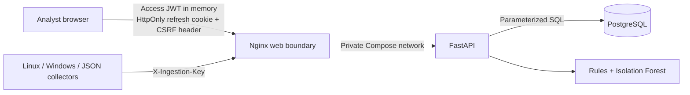

# Threat Model and Trust Boundaries

This lightweight threat model documents the security assumptions of the portfolio MVP. It is not a substitute for an independent penetration test.

## Protected assets

- analyst credentials and refresh sessions;
- the service ingestion credential;
- event, alert, evidence, and audit data;
- model thresholds and detection behavior;
- PostgreSQL availability and integrity.

## Trust boundaries

The Docker Compose deployment publishes only Nginx. The API and database remain on the internal Compose network. TLS must be terminated by a trusted ingress before an internet-facing deployment.

## Primary threats and controls

| Threat | Current control | Remaining boundary |
|---|---|---|
| Credential guessing | Constant-time password verification plus per-IP and per-IP/account rate limits | Replace the in-memory limiter with Redis for multiple replicas |
| Password database disclosure | Per-user salt and PBKDF2-HMAC-SHA256 with 600,000 iterations; legacy hashes upgrade at login | Add MFA/SSO and managed identity for production |
| Refresh-token theft/replay | HttpOnly, SameSite cookie; atomic single-use rotation; server-side token family; family revocation and audit on replay | Access JWTs remain valid until their short expiry |
| Cross-site request forgery | Strict SameSite cookies and double-submit CSRF token on refresh/logout | Internet deployments still require strict origin/TLS configuration |
| XSS session theft | Refresh token is unavailable to JavaScript; CSP restricts script sources; access token stays in memory | Any same-origin XSS can act as the user while the page is open |
| Forged collector data | Separate ingestion key, constant-time comparison, typed schema and size limits | Collectors are trusted; add per-source credentials/signatures for multi-tenant use |
| Duplicate/replayed telemetry | Unique `(source, source_event_id)` constraint, collector identifiers and Windows checkpoint | Sources without a stable event identifier receive best-effort handling |
| Historical/future manipulation | Decisions use only events at or before the target time; timestamps more than five minutes ahead are rejected | Trusted collectors may submit arbitrarily old records for backfill |
| Alert suppression through volume | Correlation queries are scoped to the relevant user/IP rather than a global event cap | Very high-cardinality deployments need streaming correlation and retention controls |
| Database compromise | Parameterized ORM queries, constraints, migrations and an internal network | Audit rows are not cryptographically immutable; backups and external log export are required |
| Container escape/privilege | Non-root images, read-only filesystems, dropped capabilities and `no-new-privileges` | Host/runtime hardening and image scanning remain deployment responsibilities |
| Dependency compromise | Exact direct versions, lockfile, SHA-pinned Actions, Dependabot, `pip-audit`, `npm audit`, Bandit and Ruff | Continue scheduled updates and review transitive changes |

## Security invariants covered by tests

- a refresh token can be consumed once only;
- replay revokes the active token family and writes an audit record;
- refresh and logout reject a missing/mismatched CSRF token;
- collector event identifiers are idempotent;
- unrelated high-volume events cannot push relevant correlation evidence out of a global limit;
- future timestamps, invalid filters, unauthorized ingestion and invalid status changes are rejected;
- production startup rejects example, weak, shared, or wildcard security configuration.

## Out of scope for this MVP

- TLS certificate management;
- MFA, SSO, tenant isolation and user administration;
- immutable audit storage, retention automation and legal/compliance controls;
- managed secrets, backup/restore drills and disaster recovery;
- distributed queues, rate limiting and model serving;
- independent penetration testing and formal privacy review.
